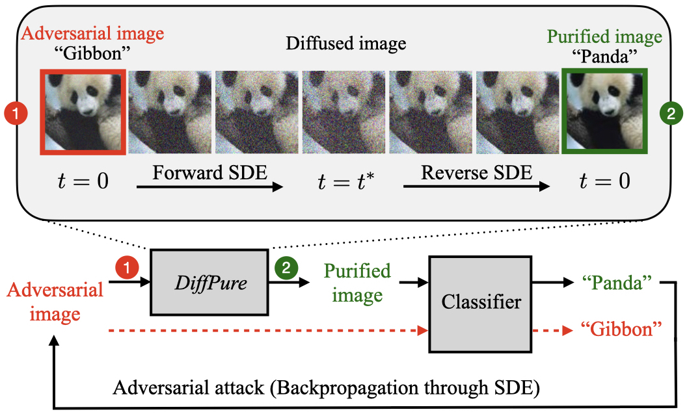

# Diffusion Models for Adversarial Purification

<p align="center">
  
</p>

Official PyTorch implementation of the ICML 2022 paper:<br>
**[Diffusion Models for Adversarial Purification](https://arxiv.org/abs/2205.07460)**
<br>
Weili Nie, Brandon Guo, Yujia Huang, Chaowei Xiao, Arash Vahdat, Anima Anandkumar<br>
https://diffpure.github.io <br>

Abstract: *Adversarial purification refers to a class of defense methods that remove adversarial perturbations using a
generative model. These methods do not make assumptions on the form of attack and the classification model, and thus can
defend pre-existing classifiers against unseen threats. However, their performance currently falls behind adversarial
training methods. In this work, we propose <i>DiffPure</i> that uses diffusion models for adversarial purification:
Given an adversarial example, we first diffuse it with a small amount of noise following a forward diffusion process,
and then recover the clean image through a reverse generative process. To evaluate our method against strong adaptive
attacks in an efficient and scalable way, we propose to use the adjoint method to compute full gradients of the reverse
generative process. Extensive experiments on three image datasets including CIFAR-10, ImageNet and CelebA-HQ with three
classifier architectures including ResNet, WideResNet and ViT demonstrate that our method achieves the state-of-the-art
results, outperforming current adversarial training and adversarial purification methods, often by a large margin.*

## Requirements

- 1-4 high-end NVIDIA GPUs with 32 GB of memory.
- 64-bit Python 3.8.
- CUDA=11.0 and docker must be installed first.
- Installation of the required library dependencies with Docker:
    ```bash
    docker build -f diffpure.Dockerfile --tag=diffpure:0.0.1 .
    docker run -it -d --gpus 0 --name diffpure --shm-size 8G -v $(pwd):/workspace -p 5001:6006 diffpure:0.0.1
    docker exec -it diffpure bash
    ```

## Data and pre-trained models

Before running our code on ImageNet and CelebA-HQ, you have to first download these two datasets. For example, you can
follow [the instructions to download CelebA-HQ](https://github.com/suvojit-0x55aa/celebA-HQ-dataset-download). Note that
we use the LMDB format for ImageNet, so you may need
to [convert the ImageNet dataset to LMDB](https://github.com/Lyken17/Efficient-PyTorch/tree/master/tools). There is no
need to download CIFAR-10 separately.

Note that you have to put all the datasets in the `datasest` directory.

For the pre-trained diffusion models, you need to first download them from the following links:

- [Score SDE](https://github.com/yang-song/score_sde_pytorch) for
  CIFAR-10: (`vp/cifar10_ddpmpp_deep_continuous`: [download link](https://drive.google.com/file/d/16_-Ahc6ImZV5ClUc0vM5Iivf8OJ1VSif/view?usp=sharing))
- [Guided Diffusion](https://github.com/openai/guided-diffusion) for
  ImageNet: (`256x256 diffusion unconditional`: [download link](https://openaipublic.blob.core.windows.net/diffusion/jul-2021/256x256_diffusion_uncond.pt))
- [DDPM](https://github.com/ermongroup/SDEdit) for CelebA-HQ:  (`CelebA-HQ`: [download link](https://image-editing-test-12345.s3-us-west-2.amazonaws.com/checkpoints/celeba_hq.ckpt))

For the pre-trained classifiers, most of them do not need to be downloaded separately, except for

- `attribute classifiers` from [gan-ensembling](https://github.com/chail/gan-ensembling) on
  CelebA-HQ: [download link](http://latent-composition.csail.mit.edu/other_projects/gan_ensembling/zips/pretrained_classifiers.zip)
- `wideresnet-70-16` on CIFAR-10: [download link](https://drive.google.com/drive/folders/1OeuFx2r26xeHncs8bGuqgY6ns_N77Avi?usp=sharing)
- `resnet-50` on CIFAR-10: [download link](https://drive.google.com/drive/folders/1SEGilIEAnx9OC1JVhmOynreCF3oog7Fi?usp=sharing)
- `wrn-70-16-dropout` on CIFAR-10: [download link](https://drive.google.com/drive/folders/1istqcnPNXJ-TQFdxRqNJuInzOtlYOG1b?usp=sharing)

Note that you have to put all the pretrained models in the `pretrained` directory.

## Run experiments on CIFAR-10

### AutoAttack Linf

- To get results of defending against AutoAttack Linf (the `Rand` version):

```bash
cd run_scripts/cifar10
bash run_cifar_rand_inf.sh [seed_id] [data_id]  # WideResNet-28-10
bash run_cifar_rand_inf_70-16-dp.sh [seed_id] [data_id]  # WideResNet-70-16
bash run_cifar_rand_inf_rn50.sh [seed_id] [data_id]  # ResNet-50
```

- To get results of defending against AutoAttack Linf (the `Standard` version):

```bash
cd run_scripts/cifar10
bash run_cifar_stand_inf.sh [seed_id] [data_id]  # WideResNet-28-10
bash run_cifar_stand_inf_70-16-dp.sh [seed_id] [data_id]  # WideResNet-70-16
bash run_cifar_stand_inf_rn50.sh [seed_id] [data_id]  # ResNet-50
```

Note that `[seed_id]` is used for getting error bars, and `[data_id]` is used for sampling a fixed set of images.

To reproduce the numbers in the paper, we recommend using three seeds (e.g., 121..123) for `[seed_id]` and eight seeds 
(e.g., 0..7) for `[data_id]`, and averaging all the results across `[seed_id]` and `[data_id]`, accordingly.
To measure the worse-case defense performance of our method, the reported robust accuracy is the minimum robust accuracy 
of these two versions: `Rand` and `Standard`.

### AutoAttack L2

- To get results of defending against AutoAttack L2 (the `Rand` version):

```bash
cd run_scripts/cifar10
bash run_cifar_rand_L2.sh [seed_id] [data_id]  # WideResNet-28-10
bash run_cifar_rand_L2_70-16-dp.sh [seed_id] [data_id]  # WideResNet-70-16
bash run_cifar_rand_L2_rn50.sh [seed_id] [data_id]  # ResNet-50
```

- To get results of defending against AutoAttack L2 (the `Standard` version):

```bash
cd run_scripts/cifar10
bash run_cifar_stand_L2.sh [seed_id] [data_id]  # WideResNet-28-10
bash run_cifar_stand_L2_70-16-dp.sh [seed_id] [data_id]  # WideResNet-70-16
bash run_cifar_stand_L2_rn50.sh [seed_id] [data_id]  # ResNet-50
```

Note that `[seed_id]` is used for getting error bars, and `[data_id]` is used for sampling a fixed set of images.

To reproduce the numbers in the paper, we recommend using three seeds (e.g., 121..123) for `[seed_id]` and eight seeds
(e.g., 0..7) for `[data_id]`, and averaging all the results across `[seed_id]` and `[data_id]`, accordingly.
To measure the worse-case defense performance of our method, the reported robust accuracy is the minimum robust accuracy
of these two versions: `Rand` and `Standard`.

### StAdv

- To get results of defending against StAdv:

```bash
cd run_scripts/cifar10
bash run_cifar_stadv_rn50.sh [seed_id] [data_id]  # ResNet-50
```

Note that `[seed_id]` is used for getting error bars, and `[data_id]` is used for sampling a fixed set of images.

To reproduce the numbers in the paper, we recommend using three seeds (e.g., 121..123) for `[seed_id]` and eight seeds
(e.g., 0..7) for `[data_id]`, and averaging all the results across `[seed_id]` and `[data_id]`, accordingly.


### BPDA+EOT

- To get results of defending against BPDA+EOT:

```bash
cd run_scripts/cifar10
bash run_cifar_bpda_eot.sh [seed_id] [data_id]  # WideResNet-28-10
```

Note that `[seed_id]` is used for getting error bars, and `[data_id]` is used for sampling a fixed set of images.

To reproduce the numbers in the paper, we recommend using three seeds (e.g., 121..123) for `[seed_id]` and five seeds
(e.g., 0..4) for `[data_id]`, and averaging all the results across `[seed_id]` and `[data_id]`, accordingly.

## Run experiments on ImageNet

### AutoAttack Linf

- To get results of defending against AutoAttack Linf (the `Rand` version):

```bash
cd run_scripts/imagenet
bash run_in_rand_inf.sh [seed_id] [data_id]  # ResNet-50
bash run_in_rand_inf_50-2.sh [seed_id] [data_id]  # WideResNet-50-2
bash run_in_rand_inf_deits.sh [seed_id] [data_id]  # DeiT-S
```

- To get results of defending against AutoAttack Linf (the `Standard` version):

```bash
cd run_scripts/imagenet
bash run_in_stand_inf.sh [seed_id] [data_id]  # ResNet-50
bash run_in_stand_inf_50-2.sh [seed_id] [data_id]  # WideResNet-50-2
bash run_in_stand_inf_deits.sh [seed_id] [data_id]  # DeiT-S
```

Note that `[seed_id]` is used for getting error bars, and `[data_id]` is used for sampling a fixed set of images.

To reproduce the numbers in the paper, we recommend using three seeds (e.g., 121..123) for `[seed_id]` and 32 seeds
(e.g., 0..31) for `[data_id]`, and averaging all the results across `[seed_id]` and `[data_id]`, accordingly.
To measure the worse-case defense performance of our method, the reported robust accuracy is the minimum robust accuracy
of these two versions: `Rand` and `Standard`.

## Run experiments on CelebA-HQ

### BPDA+EOT

- To get results of defending against BPDA+EOT:

```bash
cd run_scripts/celebahq
bash run_celebahq_bpda_glasses.sh [seed_id] [data_id]  # the glasses attribute
bash run_celebahq_bpda_smiling.sh [seed_id] [data_id]  # the smiling attribute
```

Note that `[seed_id]` is used for getting error bars, and `[data_id]` is used for sampling a fixed set of images.

To reproduce the numbers in the paper, we recommend using three seeds (e.g., 121..123) for `[seed_id]` and 64 seeds
(e.g., 0..63) for `[data_id]`, and averaging all the results across `[seed_id]` and `[data_id]`, accordingly.

## License

Please check the [LICENSE](LICENSE) file. This work may be used non-commercially, meaning for research or evaluation
purposes only. For business inquiries, please contact
[researchinquiries@nvidia.com](mailto:researchinquiries@nvidia.com).

## Citation

Please cite our paper, if you happen to use this codebase:

```
@inproceedings{nie2022DiffPure,
  title={Diffusion Models for Adversarial Purification},
  author={Nie, Weili and Guo, Brandon and Huang, Yujia and Xiao, Chaowei and Vahdat, Arash and Anandkumar, Anima},
  booktitle = {International Conference on Machine Learning (ICML)},
  year={2022}
}
```

